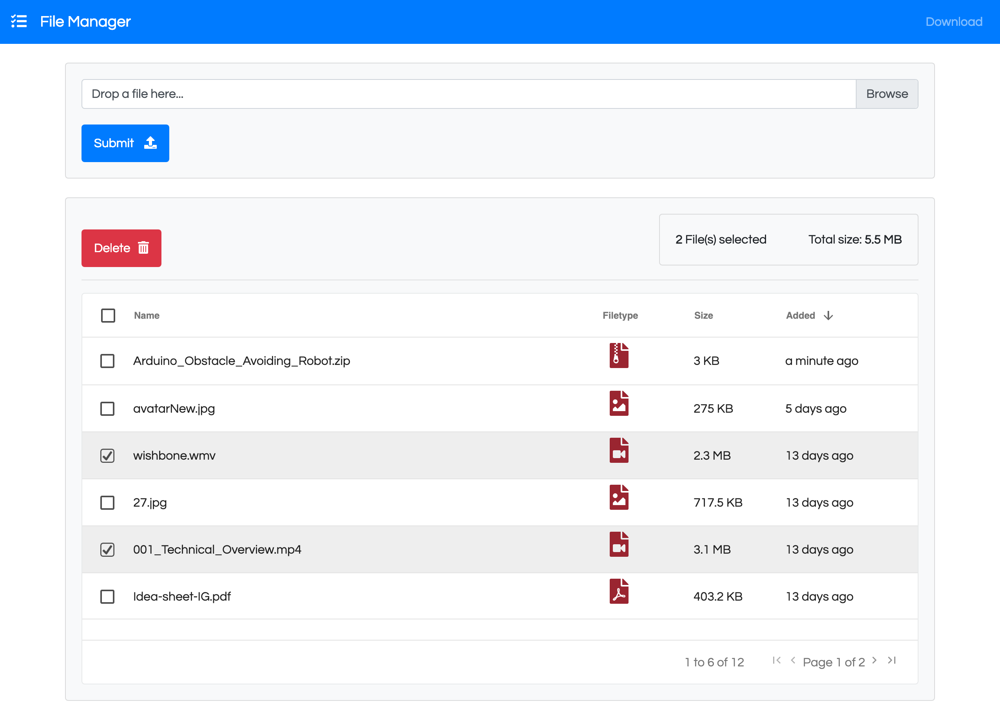

# FileManager by <a href="https://github.com/talented">Talented</a>

  <!-- 
   -->
  

## Description

> A file manager web app with Django rest framework in backend and Vue.js in frontend with ag-grid data tables integration.

## Installation

1.  Clone the repository
1.  Run `npm install`

## How To Use

For development:

1.  Run `yarn run dev`
1.  Open your browser using the url: [http://127.0.0.1:3000/](http://127.0.0.1:3000/)

For production:

1.  Run `yarn generate`
1.  Use the files under the `dist` folder and host them. Its a complete static site so it is really easy to deploy.

## Examples

<!-- * [Official site](https://www.kevinpeters.net/) -->

## Resources

<!-- ### Motivation

Wanted to try out [nuxt.js](https://nuxtjs.org/) and created a new portfolio because the old one was really bad.

## License

_File manager_ is realeased under the MIT License.

## This readme is powered by vue-readme

Check out vue-readme [[Website](https://igeligel.github.io/vue-readme) | [GitHub](https://github.com/igeligel/vue-readme)] -->
